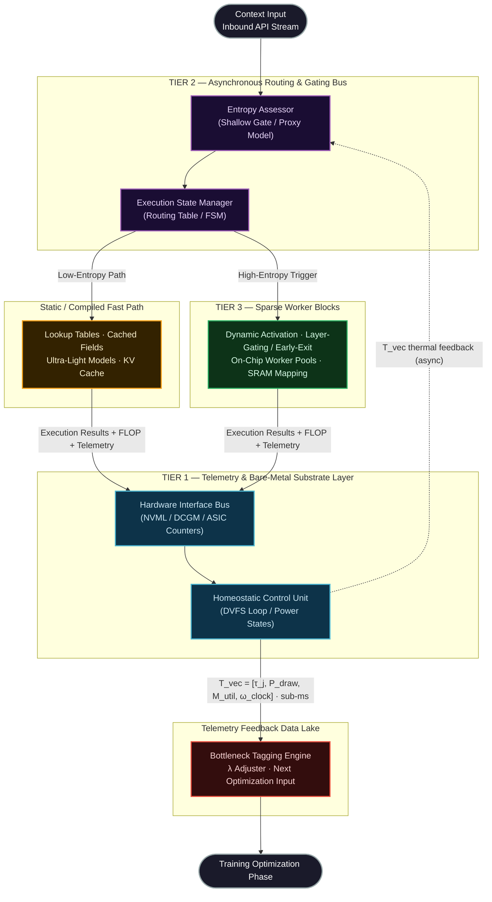

# Thermodynamically Bounded Intelligence

_Open Technical Specification_

> **Status:** Research Draft
> **Type:** Technical Proposal
> **Domain:** AI Systems Architecture · Hardware-Aware ML · Efficient Inference

## Abstract

 Large-scale machine learning systems are increasingly constrained not only by data and compute availability, but by deployment-time physical limits: energy draw, cooling capacity, memory bandwidth, latency targets, and thermal safety margins. Standard training objectives optimize task quality directly, while these deployment costs are usually handled later through engineering heuristics such as quantization, pruning, distillation, batching, and serving-time routing. This separation is practical, but incomplete: it leaves substantial efficiency gains unavailable to objectives that never observe deployment costs.

 This whitepaper presents **Thermodynamically Bounded Intelligence (TBI)** as a research program for **energy-constrained adaptive inference**. TBI does not assume that silicon temperature or power draw are exactly differentiable with respect to model weights during ordinary training. Instead, it proposes a more defensible approach: deployment telemetry is used to build surrogate cost models and control policies that influence routing, conditional depth, expert selection, compression, and periodic retraining. In this formulation, hardware cost becomes a first-class systems objective without overclaiming exact end-to-end thermodynamic backpropagation.

 The TBI proposal has two parts. The first is a **near-term software path** that is feasible on present-day accelerators: telemetry-informed routing, early exit, model cascades, expert specialization, distillation, quantization, and offline compression loops. The second is a **long-term hardware research path** involving finer-grained control of memory hierarchy and parameter residency across SRAM, HBM, and non-volatile storage. This whitepaper explicitly distinguishes the two.

 ---

 ## 1. Problem Statement

 Let a deployed model serve a workload distribution $\mathcal{D}$ over inputs $x$ with desired outputs $y$. In production, the operator cares about more than task loss. The system must also satisfy budgets over:

 - expected energy per request or per generated token
 - latency and tail latency
 - memory bandwidth pressure
 - thermal safety margins and throttling frequency
 - throughput under realistic traffic conditions

 Current frontier systems often optimize quality first and apply deployment optimizations later. TBI starts from a narrower and more testable premise:

 > **Machine-learning systems should be designed and updated to operate under explicit physical budgets, not merely optimized for task quality in isolation.**

 This is a systems claim, not a metaphysical claim about intelligence.

 ---

 ## 2. Core Thesis

 TBI advances four claims.

 1. **Deployment cost should be modeled during optimization.**  
    The relevant deployment costs are typically energy, latency, memory traffic, and thermal risk. These costs may enter the optimization process through measured statistics, learned surrogates, or constrained architecture search.

 2. **Conditional computation is a primary mechanism for efficiency.**  
    Many workloads are heterogeneous. Some requests can be handled by caches, retrieval, smaller models, or shallow computation, while others require deeper or specialized paths. Routing is therefore central.

 3. **Telemetry should inform periodic model and policy updates.**  
    Runtime traces can identify consistently expensive paths, poorly calibrated routers, and domains that benefit from distillation or compression.

 4. **Near-term and long-term claims must be separated.**  
    Adaptive routing, early exit, MoE-style specialization, compression, and offline retraining are feasible today. Fine-grained hot, warm, and cold parameter residency across SRAM, HBM, and non-volatile storage is a future hardware research direction.

 ---

 ## 3. Scope and Non-Goals

 ### In Scope

 - telemetry-informed adaptive inference
 - routing across multiple fidelity levels
 - early exit and conditional depth
 - expert or domain specialization
 - offline compression, pruning, quantization, and distillation
 - constrained optimization using learned cost surrogates
 - measurable evaluation under power, latency, and throughput budgets

 ### Out of Scope

 - a claim that physical thermodynamic variables are exactly differentiable during ordinary training
 - a claim that current GPUs expose fine-grained SRAM residency control for multi-gigabyte parameter blocks
 - a recommendation to mutate production weights in place without offline evaluation, canaries, and rollback
 - a new general theory of intelligence

 ---

 ## 4. Architectural Overview

 TBI organizes deployment into four interacting layers.

 ### 4.1 Measurement and Control

 A telemetry layer records power, energy proxies, latency, memory pressure, clock state, throttle indicators, and thermal headroom. These signals are used for diagnosis and control. Temperature is treated primarily as a **state and safety variable**, not as a precise per-request optimization target.

 ### 4.2 Adaptive Routing

 A lightweight gate decides whether a request should be served by:

 - a cache or retrieval answer
 - a small model
 - a shallow path through a larger model
 - a full model path
 - a specialized expert or domain model

 The gate may use prompt features, embeddings, recent telemetry state, calibration statistics, and retrieval signals.

 ### 4.3 Conditional Depth and Specialization

 Within the heavy path, the system may still save work through:

 - early exit at calibrated checkpoints
 - expert routing
 - domain specialization
 - precision control
 - batching and scheduling policies that adapt to current system state

 ### 4.4 Offline Optimization Pipeline

 Deployment traces are used to generate new candidates:

 - pruned or quantized variants
 - distilled smaller models
 - recalibrated routing policies
 - improved retrieval or cache indexes

 Promotion into production occurs only after offline evaluation and staged rollout.

 ---

 ## 5. Scientific Positioning

 TBI is best understood as a synthesis of ideas already present in the literature:

 - scaling-law thinking from large-model training
 - conditional computation and mixture-of-experts routing
 - early-exit networks and adaptive computation
 - model cascades and selective prediction
 - pruning, quantization, and distillation
 - telemetry-aware systems control

 The novelty of TBI is therefore **integrative** rather than foundational. Its scientific value depends on whether this integration produces materially better quality-per-joule, quality-per-second, and throughput-per-watt on real workloads.

 ---

 ## 6. Formal Summary

 A high-level TBI objective can be written as a constrained or relaxed optimization problem:

 $$
 \min \; \mathbb{E}\left[\mathcal{L}_{\text{task}}\right]
 \quad
 	ext{subject to}
 \quad
 \mathbb{E}[J] \leq B_J,\;
 \mathbb{E}[L] \leq B_L,\; 
 \mathbb{E}[M] \leq B_M,\;
 \Pr(T > T_{\text{safe}}) \leq \delta
 $$

 or, in Lagrangian form,

 $$
 \min \; \mathbb{E}\left[
 \mathcal{L}_{\text{task}}
 + \lambda_J J
 + \lambda_L L
 + \lambda_M M
 + \lambda_\chi \chi
 \right]
 $$

 where:

 - $J$ is energy cost
 - $L$ is latency cost
 - $M$ is memory or bandwidth cost
 - $\chi$ is a safety or throttling penalty
 - $T$ is thermal state
 - the costs are estimated from measurement or learned surrogates

 In TBI, these costs are not assumed to be analytically differentiable with respect to all model weights. Instead, they are estimated and optimized over the **controllable decisions**: route choice, depth, expert selection, precision, compression level, and architecture choice.

 Detailed formalism appears in [docs/01_mathematical_foundations.md](docs/01_mathematical_foundations.md).

 ---

 ## 7. Feasibility Summary

 | Component | Near-Term Feasibility | Interpretation |
 | --- | --- | --- |
 | Telemetry collection on commodity accelerators | High | Practical today, with coarse time resolution and vendor-specific limitations |
 | Telemetry-aware routing and threshold control | High | Practical today if calibrated conservatively |
 | Early exit and conditional depth | Medium to High | Practical, but highly workload-dependent and sensitive to miscalibration |
 | Domain or expert specialization | High | Already supported by multiple serving patterns |
 | Surrogate-based cost-aware optimization | Medium | Feasible, but requires careful trace collection and validation |
 | Exact per-request thermal attribution | Low | Usually too noisy or too slow for precise credit assignment |
 | Fine-grained hot, warm, cold parameter residency in SRAM and HBM | Low on current hardware | Best treated as future custom-hardware work |
 | In-place autonomous self-modification of production models | Low and unsafe | Should be replaced by an offline optimization and staged rollout pipeline |

 ---

 ## 8. Experimental Program

 A credible TBI program should be staged.

 ### Stage 1: Instrumentation and Baseline

 - collect energy, latency, throughput, and memory-pressure traces
 - identify the most expensive routes and workload slices
 - establish a strong monolithic baseline

 ### Stage 2: Adaptive Routing

 - train and calibrate a lightweight gate
 - evaluate cost-quality trade-offs under conservative escalation rules
 - report risk-coverage and cost-coverage curves

 ### Stage 3: Conditional Depth and Compression

 - add early exit checkpoints or specialized experts
 - train compressed student models
 - compare quality-per-joule and latency distributions against the baseline

 ### Stage 4: Closed-Loop Offline Adaptation

 - retrain routing and compression policies from production traces
 - validate candidates offline
 - promote only after canary evaluation

 ### Stage 5: Custom Hardware Research

 - explore whether finer-grained parameter residency control changes the operating frontier
 - treat these experiments as separate from claims about commodity accelerators

 ---

 ## 9. Documentation Guide

 - [docs/01_mathematical_foundations.md](docs/01_mathematical_foundations.md)  
   Formal problem statement, constrained optimization, surrogate cost modeling, and limitations.

 - [docs/02_tier1_telemetry.md](docs/02_tier1_telemetry.md)  
   Measurement model, metric hierarchy, attribution limits, and control policy.

 - [docs/03_tier2_routing.md](docs/03_tier2_routing.md)  
   Adaptive routing, gate calibration, escalation logic, and evaluation methodology.

 - [docs/04_tier3_sparse_workers.md](docs/04_tier3_sparse_workers.md)  
   Conditional depth, specialization, batching interactions, and the boundary between current practice and future hardware.

 - [docs/05_background_daemons.md](docs/05_background_daemons.md)  
   Offline optimization pipeline, compression workflow, evaluation gates, and deployment safety.

 ---

 ## 10. Selected Prior Work

 TBI draws on several established lines of research, including:

 - scaling laws for large language models
 - compute-optimal training
 - mixture-of-experts and conditional computation
 - adaptive computation time and early-exit networks
 - model distillation
 - pruning and quantization
 - hardware-aware model optimization and systems profiling

 Representative examples include work by Kaplan et al., Hoffmann et al., Shazeer et al., Graves, Teerapittayanon et al., and Hinton et al.

 ---

 ## 11. Conclusion

 TBI should be evaluated as a practical research agenda for **quality under physical constraint**. Its strongest near-term form is not literal thermodynamic backpropagation, but a disciplined closed loop connecting telemetry, routing, compression, and periodic retraining. The decisive question is empirical: can this loop move the Pareto frontier of quality, cost, and reliability on real workloads? That is the claim this whitepaper is designed to make testable.

The mid-2020s, however, mark a structural inflection point. The exponential growth in compute demand has systematically outpaced the realistic rate at which power grid infrastructure, cooling capacity, transformer supply chains, and energy generation can be expanded. In several major hyperscale deployment regions, **power availability**—not processor count, not memory bandwidth, not software engineering throughput—has become the hard rate-limiting factor for deploying intelligence at scale. This is the **Power Grid Wall**.

**Thermodynamically Bounded Intelligence (TBI)** is a proposed architectural paradigm engineered to address this constraint directly and formally. Rather than treating hardware operational cost as a secondary concern managed exclusively by infrastructure operations teams, TBI elevates it to a **first-class citizen of the mathematical optimization objective itself**. The result is a co-designed, hardware-aware intelligence framework whose structural topology, conditional routing logic, parameter density, and background maintenance cycles are all governed and dynamically shaped by the thermodynamic and electrical limits of the physical substrate on which they execute.

This repository constitutes the open technical specification for the TBI reference architecture.

---

## Table of Contents

- [Thermodynamically Bounded Intelligence](#thermodynamically-bounded-intelligence)
  - [Abstract](#abstract)
  - [1. Problem Statement](#1-problem-statement)
  - [2. Core Thesis](#2-core-thesis)
  - [3. Scope and Non-Goals](#3-scope-and-non-goals)
    - [In Scope](#in-scope)
    - [Out of Scope](#out-of-scope)
  - [4. Architectural Overview](#4-architectural-overview)
    - [4.1 Measurement and Control](#41-measurement-and-control)
    - [4.2 Adaptive Routing](#42-adaptive-routing)
    - [4.3 Conditional Depth and Specialization](#43-conditional-depth-and-specialization)
    - [4.4 Offline Optimization Pipeline](#44-offline-optimization-pipeline)
  - [5. Scientific Positioning](#5-scientific-positioning)
  - [6. Formal Summary](#6-formal-summary)
  - [7. Feasibility Summary](#7-feasibility-summary)
  - [8. Experimental Program](#8-experimental-program)
    - [Stage 1: Instrumentation and Baseline](#stage-1-instrumentation-and-baseline)
    - [Stage 2: Adaptive Routing](#stage-2-adaptive-routing)
    - [Stage 3: Conditional Depth and Compression](#stage-3-conditional-depth-and-compression)
    - [Stage 4: Closed-Loop Offline Adaptation](#stage-4-closed-loop-offline-adaptation)
    - [Stage 5: Custom Hardware Research](#stage-5-custom-hardware-research)
  - [9. Documentation Guide](#9-documentation-guide)
  - [10. Selected Prior Work](#10-selected-prior-work)
  - [11. Conclusion](#11-conclusion)
  - [Table of Contents](#table-of-contents)
  - [1. The Power Grid Wall](#1-the-power-grid-wall)
    - [1.1 The Scaling Orthodoxy and Its Structural Limits](#11-the-scaling-orthodoxy-and-its-structural-limits)
    - [1.2 The Thermodynamic Efficiency Problem](#12-the-thermodynamic-efficiency-problem)
    - [1.3 The TBI Thesis](#13-the-tbi-thesis)
  - [2. Thermodynamically Bounded Intelligence: Definition](#2-thermodynamically-bounded-intelligence-definition)
  - [3. System Architecture: The 3-Tier Topology](#3-system-architecture-the-3-tier-topology)
  - [4. Tier Descriptions](#4-tier-descriptions)
    - [Tier 1 — Telemetry \& Bare-Metal Substrate Layer](#tier-1--telemetry--bare-metal-substrate-layer)
    - [Tier 2 — Asynchronous Routing \& Gating Bus](#tier-2--asynchronous-routing--gating-bus)
    - [Tier 3 — Sparse Worker Blocks (Dense Cluster Array)](#tier-3--sparse-worker-blocks-dense-cluster-array)
  - [5. The Self-Optimization Lifecycle](#5-the-self-optimization-lifecycle)
  - [6. Mathematical Foundations (Summary)](#6-mathematical-foundations-summary)
  - [7. Documentation Index](#7-documentation-index)

---

## 1. The Power Grid Wall

### 1.1 The Scaling Orthodoxy and Its Structural Limits

The empirical scaling laws governing large neural networks—principally those formalized by Kaplan et al. (2020) and Hoffmann et al. (2022)—established that model performance on a wide range of tasks improves predictably as a power-law function of three resources: parameter count ($N$), training compute ($C$), and dataset size ($D$). This formalization transformed AI development from an artisanal craft into an industrial engineering discipline. Larger models, given enough compute and data, reliably outperformed their predecessors across benchmark suites, and the trajectory appeared open-ended.

The engineering response was decisive and well-funded: build larger clusters, source more GPUs and custom accelerators, and secure power purchase agreements. For several successive model generations, this strategy worked. However, the underlying resource curves do not grow at commensurate rates:

- **Model capability** scales as a sub-linear power-law function of compute; each additional unit of capability requires geometrically more FLOP expenditure.
- **Compute hardware supply** scales approximately linearly with investment, gated by semiconductor fab capacity and advanced packaging lead times.
- **Power grid infrastructure** scales at a rate bound by permitting cycles, transformer manufacturing lead times (historically 24–48 months in constrained supply environments), high-voltage transmission line construction, and regulatory approval processes measured in years, not quarters.

The divergence between the demand curve for power and the capacity of physical infrastructure to supply it is not a temporary supply-chain anomaly. It is a structural condition rooted in the physics of energy generation and distribution. A single frontier training run can consume power at a sustained rate exceeding 50–100 MW. Inference clusters serving production traffic at scale operate at comparable magnitudes. The aggregate power demand of the AI industry, growing at its historical rate, is on a collision course with the realistic capacity of electrical grids in every major deployment geography.

### 1.2 The Thermodynamic Efficiency Problem

Beyond sheer grid capacity, there is a fundamental thermodynamic efficiency argument that motivates TBI at an architectural level. In a standard monolithic large language model or transformer variant, the complete parameter set—often hundreds of billions of weights—is maintained in a continuously "hot" state: resident in high-bandwidth memory, drawing static leakage current, occupying cache bandwidth and thermal headroom. This occurs regardless of whether those parameters contribute meaningfully to the computation resolving a given input.

For any single inference token, the fraction of parameters exercising non-negligible activation gradients is small. The model's architecture is making a thermodynamically wasteful tradeoff: it maintains the full potential energy of every parameter in a primed state at all times, paying the full thermal and electrical cost of that readiness even when the actual computational demand is low.

Biological neural systems, operating under tight metabolic constraints of approximately 20 watts total power for the human neocortex, evolved the precisely opposite strategy: sparse, conditional activation; aggressive energy reclamation during quiescence; and hierarchical routing of stimulus complexity to proportionally deeper processing layers only when demanded. TBI draws structural inspiration from this principle and attempts to formalize it as a rigorous, implementable engineering framework for silicon substrates.

### 1.3 The TBI Thesis

The TBI thesis is: **the correct engineering response to the Power Grid Wall is not to continue waiting for grid infrastructure to catch up, but to redesign the intelligence engine itself to operate within whatever thermodynamic envelope the underlying physical substrate can sustainably provide—and to make that envelope a hard mathematical constraint embedded in the optimization objective from the moment of architecture design.**

---

## 2. Thermodynamically Bounded Intelligence: Definition

**Thermodynamically Bounded Intelligence (TBI)** is a machine intelligence architectural paradigm defined by the following formal properties:

**Property I — Hardware-Aware Optimization:**
The core optimization objective function explicitly incorporates real-time physical hardware cost terms, penalizing execution pathways that generate excessive thermal load, FLOP expenditure, or memory bandwidth pressure relative to the marginal improvement in task performance they provide. The system is not merely profiled for hardware cost after the fact; hardware cost is a first-order term in the loss surface the optimizer is descending.

**Property II — Conditional Runtime Sparsity:**
Parameter execution is not monolithic. Worker parameter blocks are maintained in low-power standby states by default and are dynamically provisioned into active execution caches only when the routed input complexity demands their engagement. The system's active computational footprint at any instant is proportional to the informational complexity of the work it is resolving.

**Property III — Closed-Loop Telemetry Integration:**
The boundary between training-time structural optimization and runtime inference is formally dissolved. Physical hardware telemetry collected during production inference—junction temperatures, FLOP overhead per execution path, memory bandwidth saturation events, DVFS throttle triggers—continuously feeds back into the structural optimization objective. The system evolves lighter execution pathways for context domains that have historically caused thermodynamic bottlenecks.

**Property IV — Autonomous Background Maintenance:**
During periods of reduced external query load, the system autonomously executes maintenance daemons that prune redundant parameters, consolidate episodic memory indices, and distill knowledge into more compact structural representations. This self-optimization lifecycle does not require external orchestration or engineering intervention and operates entirely within the thermal and power envelopes reported by the hardware telemetry substrate.

---

## 3. System Architecture: The 3-Tier Topology

The TBI runtime execution environment is organized into three structurally decoupled layers operating in asynchronous coordination. The following diagram maps the primary data-flow paths, control signals, and feedback loops between all architectural components.

> **Note:** Dashed arrows represent background asynchronous signals. The T_vec feedback path from Tier 1 to the Data Lake is a non-blocking async write stream and does not gate the primary inference path.

---

## 4. Tier Descriptions

### Tier 1 — Telemetry & Bare-Metal Substrate Layer

The foundation of the TBI stack. Tier 1 operates at the kernel level, interfacing directly with hardware performance counters, power management interfaces (NVML, DCGM, vendor ASIC telemetry APIs), and thermal sensor arrays. It compiles a continuous, low-latency telemetry state vector $\vec{T}$ representing the real-time physical operational state of every execution node in the cluster:

$$\vec{T} = [\tau_{\text{junction}},\; P_{\text{draw}},\; M_{\text{util}},\; \omega_{\text{clock}}]$$

A **Homeostatic Control Unit** ingests execution load profiles from Tier 2 and Tier 3 and applies Dynamic Voltage and Frequency Scaling (DVFS) adjustments to maintain all nodes within their safe operating envelopes. The telemetry stream from Tier 1 is also written to the Feedback Data Lake for integration into future structural optimization passes.

→ Full specification: [docs/02_tier1_telemetry.md](docs/02_tier1_telemetry.md)

### Tier 2 — Asynchronous Routing & Gating Bus

The system's multiplexer and traffic controller. Tier 2 sits upstream of all heavy parameter execution. An **Entropy Assessor**—a deliberately shallow, computationally inexpensive gating sub-network or heuristic proxy—evaluates the informational complexity of each inbound context vector before any weights in Tier 3 are engaged.

Based on this assessment, it routes the request to one of two execution paths:

- **Fast Path (Low-Entropy):** Routine, low-variance inputs are resolved using compiled lookup tables, cached activation fields, or ultra-lightweight linear models at near-zero energy expenditure.
- **Slow Path (High-Entropy):** Complex, high-variance inputs emit a hardware-level provisioning event to wake the appropriate Tier 3 worker block clusters.

→ Full specification: [docs/03_tier2_routing.md](docs/03_tier2_routing.md)

### Tier 3 — Sparse Worker Blocks (Dense Cluster Array)

The deep parameter execution layer. Unlike monolithic models where all parameters remain resident in hot memory at all times, Tier 3 treats parameter matrices as an **elastic, serverless compute pool**. Worker blocks are maintained in warm or cold standby states, consuming only minimal static leakage current. Upon provisioning events from Tier 2, specific blocks are mapped sequentially into execution SRAM.

**Layer-gating mechanics** allow inference to issue an early-exit return at intermediate layer $N$ when a high-confidence prediction threshold has been met, bypassing the computational cost of all subsequent layers $N+1$ through $M$—potentially eliminating a substantial fraction of the total FLOP budget for a given token prediction.

→ Full specification: [docs/04_tier3_sparse_workers.md](docs/04_tier3_sparse_workers.md)

---

## 5. The Self-Optimization Lifecycle

When external query traffic falls below a configurable threshold, or during designated maintenance windows, TBI transitions available compute into **autonomous background optimization daemons**. These daemons execute entirely within the physical constraints reported by the Tier 1 telemetry substrate and require no external orchestration. Three primary daemon classes are defined:

| Daemon Class                               | Function                                  | Mechanism                                                                                                      |
| ------------------------------------------ | ----------------------------------------- | -------------------------------------------------------------------------------------------------------------- |
| **Sparsity Daemons**                       | Eliminate redundant parameters            | Magnitude and gradient-based pruning passes; heavy quantization of low-contribution weights                    |
| **Memory Index Consolidation (Samskaras)** | Compress episodic inference logs          | Background merge of transactional records into high-dimensional relational vector anchors                      |
| **Recursive Knowledge Distillation**       | Compact the model's own parameter density | Automated self-play loops training a sub-model to mirror heavy cluster outputs under a constrained FLOP budget |

The combined effect of these daemons is continuous, autonomous reduction of the system's own thermodynamic footprint over its operational lifetime—a form of structural self-improvement bounded entirely by the hardware envelope it inhabits.

→ Full specification: [docs/05_background_daemons.md](docs/05_background_daemons.md)

---

## 6. Mathematical Foundations (Summary)

The formal underpinning of the TBI framework is a **Hardware-Aware Objective Function** that augments the standard task-specific loss with a weighted regularization term penalizing physical hardware cost:

$$\text{Loss} = \text{Loss}_{\text{task}} + \lambda \cdot \sum_{i} w_i \cdot C_i(\text{hardware})$$

Where:

- $\text{Loss}_{\text{task}}$: Standard task-specific error (e.g., cross-entropy over the token prediction distribution).
- $\lambda$: Thermodynamic regularization coefficient; a scalar that scales the global influence of hardware cost penalty terms relative to task performance error. Adjusted dynamically by the Telemetry Feedback Data Lake between optimization passes.
- $w_i$: Per-pathway weight factor, allowing differential penalization of specific execution routes based on their historical hardware cost profiles.
- $C_i(\text{hardware})$: A multi-variable cost function measuring real-time physical telemetry parameters for execution pathway $i$:

$$C_i(\text{hardware}) = f\!\left(F_i,\; M_i,\; \Delta\tau_i\right)$$

Where $F_i$ is the floating-point operation count, $M_i$ is memory bandwidth utilization pressure, and $\Delta\tau_i$ is the junction temperature delta induced by executing pathway $i$.

A central challenge—the **Gradient Challenge**—arises from the fact that physical hardware parameters such as instantaneous junction temperature and wattage draw are not differentiable functions of network weights in the standard mathematical sense. The specification addresses this through differentiable proxy surrogate models and empirical hardware profiling lookup tables.

→ Full specification: [docs/01_mathematical_foundations.md](docs/01_mathematical_foundations.md)

---

## 7. Documentation Index

| #   | Document                                                                   | Description                                                                                                                                                        |
| --- | -------------------------------------------------------------------------- | ------------------------------------------------------------------------------------------------------------------------------------------------------------------ |
| 1   | [docs/01_mathematical_foundations.md](docs/01_mathematical_foundations.md) | Hardware-aware objective function derivation, full term definitions, gradient challenge analysis, surrogate gradient models, and empirical profiling methodologies |
| 2   | [docs/02_tier1_telemetry.md](docs/02_tier1_telemetry.md)                   | Bare-metal substrate layer design, telemetry vector schema, `pynvml`-based sampling code blueprint, DVFS feedback control loop                                     |
| 3   | [docs/03_tier2_routing.md](docs/03_tier2_routing.md)                       | Routing and gating bus architecture, entropy estimation principles, fast-path and slow-path execution branches, routing state machine pseudocode                   |
| 4   | [docs/04_tier3_sparse_workers.md](docs/04_tier3_sparse_workers.md)         | Sparse worker block architecture, serverless on-chip pool model, layer-gating mechanics, early-exit mathematics, SRAM cache mapping                                |
| 5   | [docs/05_background_daemons.md](docs/05_background_daemons.md)             | Asynchronous self-optimization lifecycle, sparsity daemon mechanics, memory index consolidation (Samskaras), recursive knowledge distillation                      |

---

_tbi-spec — Thermodynamically Bounded Intelligence Open Technical Specification_
