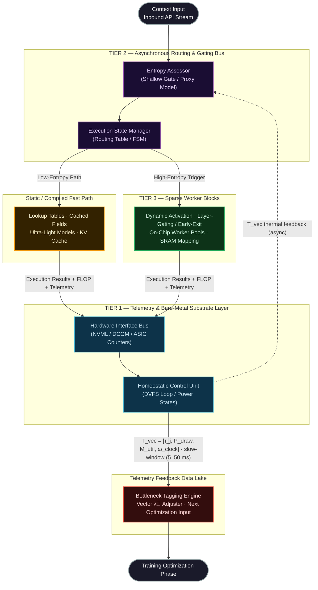

# Thermodynamically Bounded Intelligence

_Open Technical Specification_

> **Status:** Research Draft  
> **Type:** Technical Proposal  
> **Domain:** AI Systems Architecture · Hardware-Aware ML · Efficient Inference

## Motivation

The mid-2020s mark a structural inflection point. The growth in AI compute demand is increasingly constrained by physical deployment limits: power availability, cooling capacity, memory bandwidth, latency targets, and thermal safety margins.

Thermodynamically Bounded Intelligence (TBI) frames this as a systems-design problem: build and update intelligence systems under explicit physical budgets rather than optimize task quality in isolation.

## Abstract

Large-scale machine learning systems are increasingly constrained not only by data and compute availability, but by deployment-time physical limits: energy draw, cooling capacity, memory bandwidth, latency targets, and thermal safety margins. Standard training objectives optimize task quality directly, while these deployment costs are usually handled later through engineering heuristics such as quantization, pruning, distillation, batching, and serving-time routing. This separation is practical, but incomplete: it leaves substantial efficiency gains unavailable to objectives that never observe deployment costs.

This whitepaper presents **Thermodynamically Bounded Intelligence (TBI)** as a research program for **energy-constrained adaptive inference**. TBI does not assume that silicon temperature or power draw are exactly differentiable with respect to model weights during ordinary training. Instead, it proposes a more defensible approach: deployment telemetry is used to build surrogate cost models and control policies that influence routing, conditional depth, expert selection, compression, and periodic retraining. In this formulation, hardware cost becomes a first-class systems objective without overclaiming exact end-to-end thermodynamic backpropagation.

The TBI proposal has two parts. The first is a **near-term software path** that is feasible on present-day accelerators: telemetry-informed routing, early exit, model cascades, expert specialization, distillation, quantization, and offline compression loops. The second is a **long-term hardware research path** involving finer-grained control of memory hierarchy and parameter residency across SRAM, HBM, and non-volatile storage. This whitepaper explicitly distinguishes the two.

---

## Table of Contents

- [Thermodynamically Bounded Intelligence](#thermodynamically-bounded-intelligence)
  - [Motivation](#motivation)
  - [Abstract](#abstract)
  - [1. Problem Statement](#1-problem-statement)
  - [2. Core Thesis](#2-core-thesis)
  - [3. Scope and Non-Goals](#3-scope-and-non-goals)
    - [In Scope](#in-scope)
    - [Out of Scope](#out-of-scope)
  - [4. Architectural Overview](#4-architectural-overview)
    - [4.1 Measurement and Control](#41-measurement-and-control)
    - [4.2 Adaptive Routing](#42-adaptive-routing)
    - [4.3 Conditional Depth and Specialization](#43-conditional-depth-and-specialization)
    - [4.4 Offline Optimization Pipeline](#44-offline-optimization-pipeline)
    - [4.5 Self-Optimization Lifecycle](#45-self-optimization-lifecycle)
  - [5. Scientific Positioning](#5-scientific-positioning)
  - [6. Formal Summary](#6-formal-summary)
  - [7. Feasibility Summary](#7-feasibility-summary)
  - [8. Experimental Program](#8-experimental-program)
    - [Stage 1: Instrumentation and Baseline](#stage-1-instrumentation-and-baseline)
    - [Stage 2: Adaptive Routing](#stage-2-adaptive-routing)
    - [Stage 3: Conditional Depth and Compression](#stage-3-conditional-depth-and-compression)
    - [Stage 4: Closed-Loop Offline Adaptation](#stage-4-closed-loop-offline-adaptation)
    - [Stage 5: Custom Hardware Research](#stage-5-custom-hardware-research)
  - [9. Documentation Guide](#9-documentation-guide)
  - [10. Selected Prior Work](#10-selected-prior-work)
  - [11. Closing Position](#11-closing-position)
  - [License](#license)

---

## 1. Problem Statement

Let a deployed model serve a workload distribution $\mathcal{D}$ over inputs $x$ with desired outputs $y$. In production, the operator cares about more than task loss. The system must also satisfy budgets over:

- expected energy per request or per generated token
- latency and tail latency
- memory bandwidth pressure
- thermal safety margins and throttling frequency
- throughput under realistic traffic conditions

Current frontier systems often optimize quality first and apply deployment optimizations later. TBI starts from a narrower and more testable premise:

> **Machine-learning systems should be designed and updated to operate under explicit physical budgets, not merely optimized for task quality in isolation.**

This is a systems claim, not a metaphysical claim about intelligence.

---

## 2. Core Thesis

TBI advances four claims.

1. **Deployment cost should be modeled during optimization.**  
   The relevant deployment costs are typically energy, latency, memory traffic, and thermal risk. These costs may enter the optimization process through measured statistics, learned surrogates, or constrained architecture search.

2. **Conditional computation is a primary mechanism for efficiency.**  
   Many workloads are heterogeneous. Some requests can be handled by caches, retrieval, smaller models, or shallow computation, while others require deeper or specialized paths. Routing is therefore central.

3. **Telemetry should inform periodic model and policy updates.**  
   Runtime traces can identify consistently expensive paths, poorly calibrated routers, and domains that benefit from distillation or compression.

4. **Near-term and long-term claims must be separated.**  
   Adaptive routing, early exit, MoE-style specialization, compression, and offline retraining are feasible today. Fine-grained hot, warm, and cold parameter residency across SRAM, HBM, and non-volatile storage is a future hardware research direction.

TBI is formally characterized by four properties:

**Property I — Hardware-Aware Optimization:**  
The core optimization objective explicitly incorporates real-time physical hardware cost terms, penalizing execution pathways that generate excessive thermal load, FLOP expenditure, or memory bandwidth pressure relative to the marginal improvement in task performance they provide. Hardware cost is a first-order term in the optimization objective, not merely a post-hoc profile.

**Property II — Conditional Runtime Sparsity:**  
Computational work is not monolithic. At the software layer, execution is routed through the cheapest path that meets quality requirements for each request — small models, cached results, shallow exits, or expert subsets — with the deep heavy path invoked only when simpler paths are demonstrably insufficient. The active FLOP and memory-bandwidth footprint at any instant scales with the informational complexity of the request, not with the maximum parameter count of the largest available model.

**Property III — Closed-Loop Telemetry Integration:**  
Physical hardware telemetry collected during production inference—junction temperatures, FLOP overhead per execution path, memory bandwidth saturation events, DVFS throttle triggers—continuously feeds back into the structural optimization objective. The system evolves lighter execution pathways for context domains that have historically caused thermodynamic bottlenecks.

**Property IV — Autonomous Background Maintenance:**  
During periods of reduced external query load, the system autonomously executes maintenance daemons that prune redundant parameters, consolidate episodic memory indices, and distill knowledge into more compact structural representations. This self-optimization lifecycle operates entirely within the thermal and power envelopes reported by the hardware telemetry substrate.

---

## 3. Scope and Non-Goals

### In Scope

- telemetry-informed adaptive inference
- routing across multiple fidelity levels
- early exit and conditional depth
- expert or domain specialization
- offline compression, pruning, quantization, and distillation
- constrained optimization using learned cost surrogates
- measurable evaluation under power, latency, and throughput budgets

### Out of Scope

- a claim that physical thermodynamic variables are exactly differentiable during ordinary training
- a claim that current GPUs expose fine-grained SRAM residency control for multi-gigabyte parameter blocks
- a recommendation to mutate production weights in place without offline evaluation, canaries, and rollback
- a new general theory of intelligence

---

## 4. Architectural Overview

TBI organizes deployment into four interacting layers. The diagram below maps the primary data-flow paths, control signals, and feedback loops between all architectural components.

> **Note:** Dashed arrows represent background asynchronous signals. The T_vec feedback path from Tier 1 to the Data Lake is a non-blocking async write stream and does not gate the primary inference path.

---

### 4.1 Measurement and Control

The telemetry layer maintains a continuous state vector $\vec{T}$ representing the physical operational state of every execution node:

$$\vec{T} = [\tau_{\text{junction}},\; P_{\text{draw}},\; M_{\text{util}},\; \omega_{\text{clock}}]$$

**Dual-Window Telemetry Architecture.** These signals operate on fundamentally incompatible time scales and must not be collapsed into a single polling loop. TBI enforces a strict two-window separation:

- **Fast window** ($\leq 1$ ms): kernel-level FLOP counters, request timestamps, achieved memory bandwidth, and route-level latency. These are gathered at kernel or micro-batch granularity with zero sensor lag and form the primary optimization substrate.
- **Slow window** ($\geq 5\text{–}50$ ms): junction temperature, DVFS state, board power, and thermal headroom. These are consumed exclusively as control and safety signals, not as per-request cost targets.

Conflating the two windows — for example, attributing a vendor-reported 10 ms power average to a 3 ms token generation event — produces systematic attribution errors that corrupt both surrogate cost models and routing policies. The separation is a hard architectural requirement.

**Analytical Energy Proxy.** Raw integration of vendor power readings ($\int P(t)\,dt$) is replaced by a FLOP-count proxy calibrated from periodic offline profiling:

$$\hat{J}_k = \alpha_k \cdot \text{FLOP}(x,\, k) + \beta_k$$

where $\alpha_k$ is a per-route joules-per-FLOP coefficient and $\beta_k$ is a per-route memory-access cost term, both estimated from micro-benchmarks at representative batch shapes. This proxy is deterministic, zero-latency, and immune to NVML polling jitter and idle-power baseline drift. The two-parameter form is valid only for **compute-bound paths** (arithmetic intensity $I_k = \mathrm{FLOP}(x,k)/\mathrm{bytes}(x,k)$ above the hardware roofline ridge point $I_k^*$).

**Memory-Bandwidth-Bound Extension.** For memory-bandwidth-bound routes — specifically autoregressive decoding at long context, where KV cache reads dominate — $\beta_k$ must be conditioned on sequence length:

$$\hat{J}_k = \alpha_k \cdot \mathrm{FLOP}(x,k) + \beta_k^{(0)} + \beta_k^{(1)} \cdot L_{\text{seq}}$$

where $\beta_k^{(1)}$ is the per-token KV cache read cost, calibrated from per-layer bandwidth measurements at representative concurrency levels. Evaluations must identify whether each route is compute-bound or memory-bandwidth-bound and apply the appropriate proxy form.

**Sensor-Delay Compensation.** The routing gate at request time consumes $\vec{T}(t - \Delta t_{\text{sensor}})$, a delayed observation with $\Delta t_{\text{sensor}} \in [1, 10]$ ms on commodity accelerators. TBI models this delay explicitly. Threshold updates from the Homeostatic Control Unit are passed through a low-pass filter with cutoff frequency:

$$\omega_c \leq \frac{1}{2\,\Delta t_{\text{sensor}}}$$

The DVFS adjustment loop is gain-scheduled. No closed-form gain bound exists without hardware-specific plant identification: the actual DVFS plant is nonlinear (clock states snap between discrete P-states) and thermal plant parameters $(R_\theta, C_\theta)$ are operating-point-dependent. The proportional gain $K$ must satisfy a **45° phase-margin requirement** verified by a standardized step-response stability test: apply a 10°C step in $\tau_{\text{junction}}$ at nominal load and confirm that the closed-loop DVFS response settles within $5\,R_\theta C_\theta$ with less than 15% overshoot. For hardware-uncharacterized deployments, a conservative starting estimate for a linearized first-order thermal plant with pure sensor delay is:

$$K \leq \frac{1}{4\,\omega_c\,\Delta t_{\text{sensor}}\,R_\theta}$$

where $R_\theta$ is the measured junction-to-case thermal resistance (°C/W) at the nominal operating clock state. This estimate must be empirically validated before production deployment. Temperature remains a **state and safety variable** — the HCU uses it only to trigger conservative, reversible threshold adjustments within prevalidated bounds.

→ Full specification: [docs/02_tier1_telemetry.md](docs/02_tier1_telemetry.md)

### 4.2 Adaptive Routing

An **Entropy Assessor** — a deliberately shallow, computationally inexpensive gating sub-network or heuristic proxy — evaluates the informational complexity of each inbound context vector before any heavy computation is engaged. Based on this assessment, it routes to one of two execution paths:

- **Fast Path (Low-Entropy):** Routine, low-variance inputs are resolved using compiled lookup tables, cached activation fields, or ultra-lightweight models at near-zero energy expenditure.
- **Slow Path (High-Entropy):** Complex, high-variance inputs trigger provisioning of the appropriate deep worker block clusters.

The gate may use prompt features, embeddings, recent telemetry state, calibration statistics, and retrieval signals.

**Formal Gate Efficiency Constraint.** The Entropy Assessor is thermodynamically justified only when its execution overhead is bounded by the savings it enables. Let $C_g$ denote the total gate cost in combined FLOPs and memory bandwidth, $C_f$ the fast-path cost, $C_s$ the slow-path cost, and $p^{\ast}$ the expected escalation rate on the target workload. Two independent constraints must both hold:

$$C_g \leq \epsilon_f \cdot C_f, \qquad \epsilon_f \in [0.01,\; 0.05]$$

$$C_g \leq \epsilon_n \cdot (1 - p^*)(C_s - C_f), \qquad \epsilon_n \leq 0.10$$

The first constraint — gate overhead at most 1–5% of the fast path's own FLOP and bandwidth budget — prevents the gate from materially degrading the fast path's energy advantage. The second ensures the gate consumes at most 10% of the routing savings margin, preserving a 10× efficiency buffer against measurement error and workload variation. Any gate architecture that violates either constraint at the observed $p^{\ast}$ must be rejected or restructured before deployment. $p^{\ast}$ is tracked as a rolling 7-day empirical percentile from production traffic logs, not a fixed design parameter. When workload shift causes a previously compliant gate to exceed either constraint at the current $p^{\ast}$, a routing-policy review is triggered within 72 hours: either restructure the gate, or adjust escalation thresholds to restore compliance.

**Shared Embedding Architecture.** If the gate uses a compact encoder to derive request embeddings, that encoder is promoted to a **shared prefill step** executed once per request — its cost is amortized across downstream routing, retrieval, and KV-cache operations and is not counted within the per-decision gate budget $C_g$. Where the serving stack supports it, encoder weights should be pinned in device memory using platform-specific mechanisms (e.g., NVIDIA MPS memory locking, PyTorch persistent allocation pools) to minimize cold-load latency; on stacks without memory-pinning APIs, the encoder must be excluded from the KV cache eviction pool under a separate allocation policy, and cold-load latency penalties must be measured and reported (if they exceed $0.1 \times C_g$, the shared-prefill amortization benefit must be recalculated). The gate's real-time decision logic — threshold evaluation, FSM lookup, telemetry-aware adjustment — must independently satisfy both constraints above at $\leq 1\text{–}5\%$ of the fast path's combined FLOP and memory-bandwidth budget.

**Coverage Requirement.** Routing gains are highly workload-dependent. Any evaluation must report the risk-coverage curve across the full empirical range of escalation rates $p \in [0, 1]$. The gate must demonstrate positive thermodynamic ROI at the 90th-percentile escalation rate $p_{90}$ observed in production traffic. ROI is necessarily negative at $p \to 1$ (gate executes with zero savings), so the requirement applies up to $p_{90}$, not universally across $p \in [0, 1]$. Efficiency claims reported only at the median escalation rate are insufficient for publication-grade evaluation.

→ Full specification: [docs/03_tier2_routing.md](docs/03_tier2_routing.md)

### 4.3 Conditional Depth and Specialization

Within the heavy path, the system may still save work through:

- early exit at calibrated checkpoints
- expert routing
- domain specialization
- precision control
- batching and scheduling policies that adapt to current system state

**Layer-gating mechanics** allow inference to issue an early-exit return at intermediate layer $N$ when a high-confidence prediction threshold has been met, bypassing the computational cost of all subsequent layers—potentially eliminating a substantial fraction of the total FLOP budget for a given token prediction.

→ Full specification: [docs/04_tier3_sparse_workers.md](docs/04_tier3_sparse_workers.md)

### 4.4 Offline Optimization Pipeline

Deployment traces are used to generate new candidates:

- pruned or quantized variants
- distilled smaller models
- recalibrated routing policies
- improved retrieval or cache indexes

Promotion into production occurs only after offline evaluation and staged rollout.

### 4.5 Self-Optimization Lifecycle

When external query traffic falls below a configurable threshold, or during designated maintenance windows, TBI transitions available compute into **background optimization daemons**. These daemons execute within the physical constraints reported by the Tier 1 telemetry substrate. Three primary daemon classes are defined:

| Daemon Class | Function | Mechanism |
| --- | --- | --- |
| **Sparsity Daemons (Viveka)** | Eliminate redundant parameters | Magnitude and gradient-based pruning passes; heavy quantization of low-contribution weights |
| **Memory Index Consolidation (Samskaras)** | Compress episodic inference logs | Background merge of transactional records into high-dimensional relational vector anchors |
| **Recursive Knowledge Distillation (Sutra)** | Compact the model's own parameter density | Automated self-play loops training a sub-model to mirror heavy cluster outputs under a constrained FLOP budget |

**Net-Negative Joule Amortization Constraint.** No daemon class is thermodynamically justified by its intent alone. Every candidate promotion must pass a mandatory energy amortization gate before entering the staging pipeline:

$$\frac{E_{\text{daemon}}}{|\Delta J_{\text{serving}}| \cdot R_{\text{projected}}} \leq H_{\text{amortize}}$$

where $E_{\text{daemon}}$ is the measured energy cost of the daemon run, $|\Delta J_{\text{serving}}|$ is the measured per-request energy improvement under the new candidate, $R_{\text{projected}}$ is the expected request count over the model's remaining deployment window, and $H_{\text{amortize}}$ is a configurable maximum amortization horizon (default: 30 days). A candidate that passes quality and latency gates but fails this inequality is a net energy consumer over its deployment lifetime and must not be promoted.

**Diminishing-Returns Stopping Criterion.** Iterative daemon passes exhibit concave marginal returns: successive pruning or compression rounds recover less redundancy at constant compute cost. Daemon cycles terminate automatically when marginal per-request energy improvement falls below an operator-defined threshold $\kappa$:

$$\frac{\partial\,|\Delta J_{\text{saving}}|}{\partial\,n_{\text{rounds}}} \leq \kappa$$

Running daemon iterations past this boundary inverts the energy ROI and is treated as a configuration defect. The threshold $\kappa$ is calibrated as the 10th percentile of per-round $|\Delta J_{\text{saving}}|$ observed during the first three daemon rounds on the target model and workload, placing the stopping boundary below the empirical minimum productive improvement.

**Grid-Aware Efficiency Policy.** TBI's thermodynamic framing requires that energy accounting not conflate Joule consumption with carbon impact. Off-peak scheduling that minimizes GPU idle time can worsen grid carbon intensity when off-peak hours are served by baseload carbon generation rather than renewable dispatch. TBI therefore mandates a **Grid-Aware Efficiency Policy** for daemon scheduling:

- Daemon windows are scheduled against a real-time grid carbon-intensity forecast (e.g., WattTime or Electricity Maps). Daemon execution is preferred when marginal grid carbon intensity $\gamma(t)$ is at or below the rolling 24-hour median $\bar{\gamma}_{24h}$.
- The effective thermodynamic scheduling metric is the carbon-adjusted energy cost $E_{\text{carbon}} = E_{\text{daemon}} \cdot \gamma(t)$, not raw Joules alone.

**Carbon-Unified Amortization.** When Grid-Aware scheduling is active, the Joule-denominated amortization gate and the carbon scheduling metric must share a unified objective. A daemon that runs longer at low $\gamma(t)$ may consume more Joules but fewer kg CO₂e; the Joule gate alone would incorrectly reject it. In carbon-accounting mode, the amortization gate uses carbon-equivalent units:

$$\frac{E_{\text{daemon}} \cdot \gamma(t_{\text{run}})}{|\Delta J_{\text{serving}}| \cdot \bar{\gamma}_{24h} \cdot R_{\text{projected}}} \leq H_{\text{amortize}}$$

where $\gamma(t_{\text{run}})$ is the actual grid carbon intensity at daemon execution time and $\bar{\gamma}_{24h}$ is the rolling 24-hour median used to estimate forward serving-time carbon savings. When Grid-Aware scheduling is inactive, the original Joule-denominated gate applies.

**Thermal Recovery Gap.** Daemon runs at full GPU utilization delay thermal recovery of the package. A mandatory cooldown gap $\Delta t_{\text{cool}}$ is enforced between the end of any daemon window and the start of the subsequent peak traffic window:

$$\Delta t_{\text{cool}} \geq 1.5 \cdot R_\theta C_\theta \ln\!\left(\frac{\tau_{\text{daemon}} - \tau_{\text{ambient}}}{\tau_{\text{target}} - \tau_{\text{ambient}}}\right)$$

where $R_\theta$ and $C_\theta$ are the thermal resistance and capacitance of the **dominant thermal node** — junction-to-heatsink for air-cooled hardware, junction-to-coolant for liquid-cooled hardware (from package datasheets). The 1.5× safety factor accounts for multi-node thermal coupling: GPU packages exhibit a cascade of thermal nodes (die, package, TIM, heatsink) with distinct time constants; the single-pole formula underestimates recovery time when the heatsink has not equilibrated. Where hardware thermal models are unavailable, this window defaults to empirical measurement across at least 20 run-cooldown cycles; the bound must be set at the **95th percentile** of measured recovery times, not the mean.

The combined effect is a self-optimization lifecycle that is verifiably net-positive over each amortization horizon — bounded by both the hardware envelope and the carbon envelope of the grid it inhabits.

→ Full specification: [docs/05_background_daemons.md](docs/05_background_daemons.md)

---

## 5. Scientific Positioning

TBI is best understood as a synthesis of ideas already present in the literature:

- scaling-law thinking from large-model training
- conditional computation and mixture-of-experts routing
- early-exit networks and adaptive computation
- model cascades and selective prediction
- pruning, quantization, and distillation
- telemetry-aware systems control

The novelty of TBI is therefore **integrative** rather than foundational. Its scientific value depends on whether this integration produces materially better quality-per-joule, quality-per-second, and throughput-per-watt on real workloads.

---

## 6. Formal Summary

A high-level TBI objective is stated as a constrained optimization problem over the serving system's controllable decisions:

$$
\min \; \mathbb{E}\left[\mathcal{L}_{\text{task}}\right]
\quad
\text{subject to}
\quad
\mathbb{E}[J] \leq B_J,\;
\mathbb{E}[L] \leq B_L,\;
\mathbb{E}[M] \leq B_M,\;
\Pr(T > T_{\text{safe}}) \leq \delta
$$

**Continuous Relaxation for Discrete Routing.** Route selection, early-exit depth, expert assignment, and quantization level are inherently discrete decisions. The standard Lagrangian relaxation of a mixed-integer program does not generally yield integer-feasible solutions; the duality gap can be nonzero and problem-dependent. TBI therefore adopts a **stochastic policy formulation** for routing:

$$k \sim \pi_\phi(x, s) = \text{Gumbel-Softmax}\!\left(g_\phi(x, s),\; \tau_{\text{temp}}\right)$$

where $g_\phi(x, s)$ are the gate logits, $\tau_{\text{temp}}$ is a temperature parameter annealed during offline policy optimization, and the Gumbel-Softmax reparameterization provides differentiable surrogate gradients through the discrete routing decision. At deployment, the policy is evaluated in hard mode (argmax). For multi-step escalation trees where Gumbel-Softmax is structurally inapplicable, the REINFORCE estimator with a learned variance-reducing baseline is used instead.

The Lagrangian relaxation is applied to the **continuous** policy parameters and surrogate cost terms:

$$
\min_{\theta, \phi, a} \;\mathbb{E}\!\left[\mathcal{L}_{\text{task}} + \lambda_J J + \lambda_L L + \lambda_M M + \lambda_\chi \chi\right]
$$

where:

- $J$ is energy cost, estimated via the FLOP-count analytical proxy $\hat{J}_k = \alpha_k \cdot \text{FLOP}(x,k) + \beta_k$
- $L$ is latency cost
- $M$ is memory or bandwidth cost
- $\chi$ is a safety or throttling penalty
- $T$ is thermal state, treated as a constraint variable and never differentiated directly
- all costs are estimated from measurement or learned surrogates

**Stable Lambda Update with PID Damping.** Naive proportional dual ascent produces limit cycles when cost feedback carries delay $\Delta t$. TBI mandates a derivative-damped update with hysteresis:

$$
\lambda_k^{(t+1)} = \max\!\left(0,\; \lambda_k^{(t)} + \alpha_\lambda \cdot e_k^{(t)} + \mu \cdot \frac{e_k^{(t)} - e_k^{(t-1)}}{\Delta t} \right)
$$

where $e_k^{(t)} = \hat{C}_k^{(t)} - B_k$ is the constraint violation measured as an exponentially-weighted moving average over a window of $W$ requests, $\alpha_\lambda$ is the proportional gain, and $\mu$ is the derivative damping coefficient. Both gains are bounded:

$$\alpha_\lambda \leq \frac{1}{L_\psi \cdot W}, \qquad \mu \leq \frac{\alpha_\lambda \cdot \Delta t}{2}$$

The bound on $\alpha_\lambda$ follows from the Lipschitz condition on the surrogate; $L_\psi$ is estimated empirically as the maximum observed $\|\hat{\mathbf{c}}_\psi(z) - \hat{\mathbf{c}}_\psi(z')\| / \|z - z'\|$ over a held-out calibration set, or enforced by spectral normalization of the surrogate network layers. The bound on $\mu$ prevents the discrete derivative term from reversing the proportional step direction under sustained constraint violation — exceeding it destabilizes the multiplier in the same way as an oversized $\alpha_\lambda$. A hysteresis band of width $\pm\eta_k$ around each constraint boundary $B_k$ prevents rapid multiplier cycling: the multiplier updates only when $|e_k^{(t)}| > \eta_k$.

**Importance-Weighted Surrogate Retraining.** The surrogate $\hat{\mathbf{c}}_\psi$ is trained on traces collected under a prior policy $\pi_\phi^{\text{old}}$. When the routing policy is updated to $\pi_\phi^{\text{new}}$, covariate shift invalidates the surrogate on the new request distribution. Surrogate retraining is triggered when routing distribution shift exceeds a calibrated KL threshold:

$$\mathbb{E}_{z \sim \mathcal{D}_{\text{trace}}}\!\left[\mathrm{KL}\!\left(\pi_\phi^{\text{new}}(\cdot \mid z) \;\Big\|\; \pi_\phi^{\text{old}}(\cdot \mid z)\right)\right] > \delta_{\mathrm{KL}}$$

This trigger is reparameterization-invariant. An L2 norm on policy parameters misfires under overparameterization: a small weight change near a decision boundary can flip routing for many requests, while a large weight change in an overparameterized region may change nothing. $\delta_{\mathrm{KL}}$ is calibrated to the 95th percentile of this KL divergence over an ensemble of offline random-restart policy optimization runs on a held-out workload slice.

Retraining uses variance-normalized, importance-weighted empirical risk minimization with clipped weights:

$$\min_\psi \sum_i w_i \left\|\mathbf{D}^{-1/2}\!\left(\hat{\mathbf{c}}_\psi(z_i) - c_i\right)\right\|_2^2 + \eta\|\psi\|_2^2, \qquad w_i = \mathrm{clip}\!\left(\frac{p_{\text{new}}(z_i)}{p_{\text{old}}(z_i)},\; \tfrac{1}{10},\; 10\right)$$

where $\mathbf{D} = \mathrm{diag}(\hat{\sigma}_J^2, \hat{\sigma}_L^2, \hat{\sigma}_M^2, \hat{\sigma}_\chi^2)$ is the empirical per-component variance matrix of the cost vector in the trace dataset. Variance normalization prevents the cost component with the largest absolute scale (typically $M$, memory bandwidth in bytes, $\mathcal{O}(10^9)$, versus $J$ in millijoules, $\mathcal{O}(10^{-3})$) from dominating the regression objective. The weight clip at $[0.1, 10]$ bounds IS variance — unclipped density ratios from a neural discriminator can have unbounded variance when old and new routing distributions have near-disjoint support. The binary throttling indicator $\chi$ is trained with a separate cross-entropy head; the total surrogate loss sums the normalized-MSE regression heads $(J, L, M)$ and the cross-entropy head $(\chi)$.

**Unit Normalization Convention.** All cost terms entering the Lagrangian are normalized: $J$ in millijoules-per-token, $L$ in milliseconds, $M$ in gigabytes-per-request. Lagrange multipliers $\lambda_k$ carry the reciprocal units, ensuring the step-size bound $\alpha_\lambda \leq 1/(L_\psi W)$ is evaluated in consistent dimensions across all constraint types.

**Optimization Loop Structure.** The three adaptation mechanisms above operate at different time scales and must not be interleaved unsafely. The canonical outer loop, executed once per deployment cycle (typically weekly):

1. **Collect traces** from the deployment period.
2. **Retrain surrogate** $\psi$ — with IW correction and variance normalization if the KL trigger fires — on traces collected under $\pi_\phi^{\text{old}}$.
3. **Update multipliers** $\{\lambda_k\}$ with PID-damped dual ascent using constraint violations from the deployment period.
4. **Optimize policy** $\phi$ by policy gradient through Gumbel-Softmax against the updated surrogate and multipliers, for $N_{\text{policy}}$ gradient steps, with $\theta$ and $\psi$ held fixed.
5. **Promote** the updated $\phi$ through the evaluation pipeline if it improves the operator objective.

Model weights $\theta$ are **never updated in this loop** — they belong exclusively to the distillation and compression pipeline (§4.4). Jointly updating $\theta$ and $\phi$ here conflates routing adaptation with model mutation and violates the separation of online and offline actions.

In TBI, physical costs are not assumed to be analytically differentiable with respect to all model weights. Optimization operates over the **controllable decisions** — route choice, depth, expert selection, precision, compression level, and architecture choice — with the mechanisms above ensuring the optimization loop is stable, self-correcting, and free of duality-gap pathologies on discrete action spaces.

Detailed formalism appears in [docs/01_mathematical_foundations.md](docs/01_mathematical_foundations.md).

---

## 7. Feasibility Summary

| Component | Near-Term Feasibility | Interpretation |
| --- | --- | --- |
| Telemetry collection on commodity accelerators | High | Practical today, with coarse time resolution and vendor-specific limitations |
| Telemetry-aware routing and threshold control | High | Practical today if calibrated conservatively |
| Early exit and conditional depth | Medium to High | Practical, but highly workload-dependent and sensitive to miscalibration |
| Domain or expert specialization | High | Already supported by multiple serving patterns |
| Surrogate-based cost-aware optimization | Medium | Feasible, but requires careful trace collection and validation |
| Exact per-request thermal attribution | Low | Usually too noisy or too slow for precise credit assignment |
| Fine-grained hot, warm, cold parameter residency in SRAM and HBM | Low on current hardware | Best treated as future custom-hardware work |
| In-place autonomous self-modification of production models | Low and unsafe | Should be replaced by an offline optimization and staged rollout pipeline |

---

## 8. Experimental Program

A credible TBI program should be staged.

### Stage 1: Instrumentation and Baseline

- collect energy, latency, throughput, and memory-pressure traces
- identify the most expensive routes and workload slices
- establish a strong monolithic baseline

### Stage 2: Adaptive Routing

- train and calibrate a lightweight gate
- evaluate cost-quality trade-offs under conservative escalation rules
- report risk-coverage and cost-coverage curves

### Stage 3: Conditional Depth and Compression

- add early exit checkpoints or specialized experts
- train compressed student models
- compare quality-per-joule and latency distributions against the baseline

### Stage 4: Closed-Loop Offline Adaptation

- retrain routing and compression policies from production traces
- validate candidates offline
- promote only after canary evaluation

### Stage 5: Custom Hardware Research

- explore whether finer-grained parameter residency control changes the operating frontier
- treat these experiments as separate from claims about commodity accelerators

---

## 9. Documentation Guide

- [docs/01_mathematical_foundations.md](docs/01_mathematical_foundations.md)  
  Formal problem statement, constrained optimization, surrogate cost modeling, and limitations.

- [docs/02_tier1_telemetry.md](docs/02_tier1_telemetry.md)  
  Measurement model, metric hierarchy, attribution limits, and control policy.

- [docs/03_tier2_routing.md](docs/03_tier2_routing.md)  
  Adaptive routing, gate calibration, escalation logic, and evaluation methodology.

- [docs/04_tier3_sparse_workers.md](docs/04_tier3_sparse_workers.md)  
  Conditional depth, specialization, batching interactions, and the boundary between current practice and future hardware.

- [docs/05_background_daemons.md](docs/05_background_daemons.md)  
  Offline optimization pipeline, compression workflow, evaluation gates, and deployment safety.

---

## 10. Selected Prior Work

TBI draws on several established lines of research, including:

- scaling laws for large language models
- compute-optimal training
- mixture-of-experts and conditional computation
- adaptive computation time and early-exit networks
- model distillation
- pruning and quantization
- hardware-aware model optimization and systems profiling

Representative examples include work by Kaplan et al., Hoffmann et al., Shazeer et al., Graves, Teerapittayanon et al., and Hinton et al.

---

## 11. Closing Position

TBI is proposed as a research agenda for **quality under physical constraint**. Its strongest near-term form is not literal thermodynamic backpropagation, but a disciplined closed loop connecting telemetry, routing, compression, and periodic retraining. The central hypothesis is empirical: can this loop move the Pareto frontier of quality, cost, and reliability on real workloads?

---

## License

This project is licensed under the Apache License 2.0. See [LICENSE](LICENSE).

---

_tbi-spec — Thermodynamically Bounded Intelligence Open Technical Specification_
